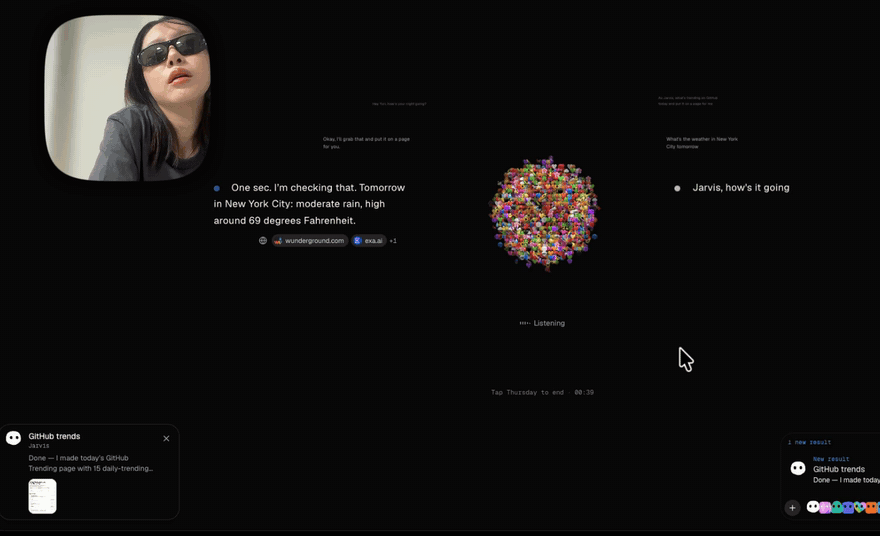
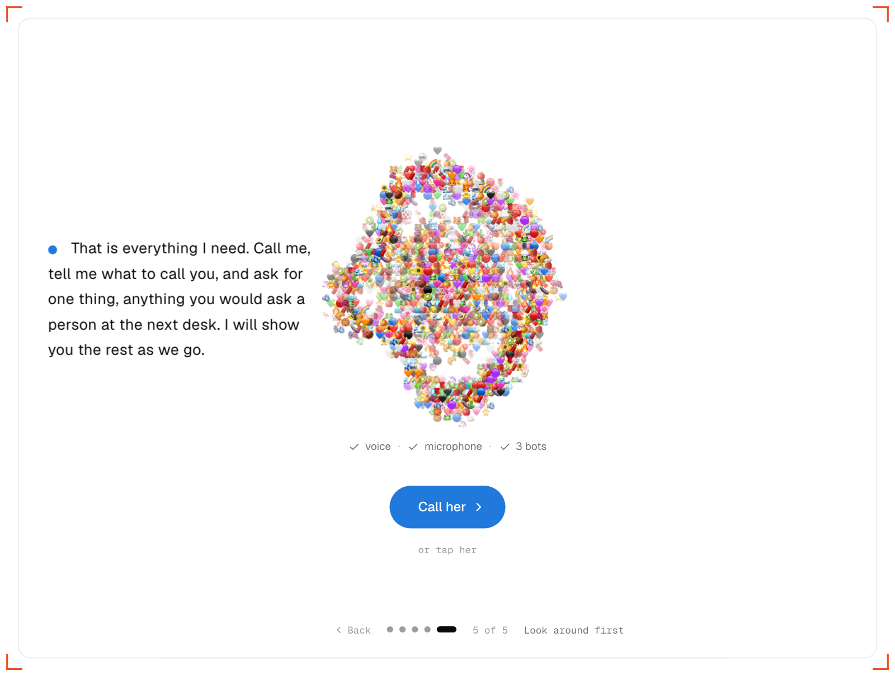
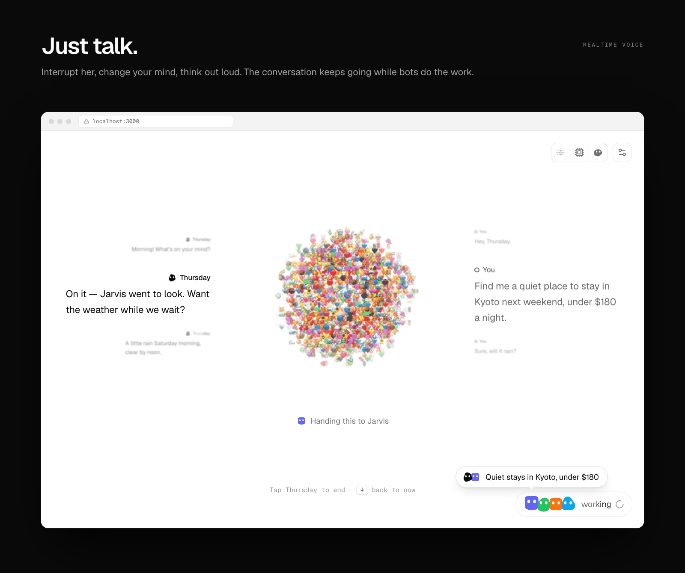
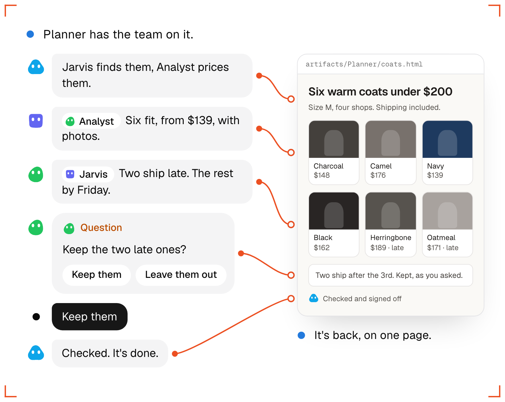
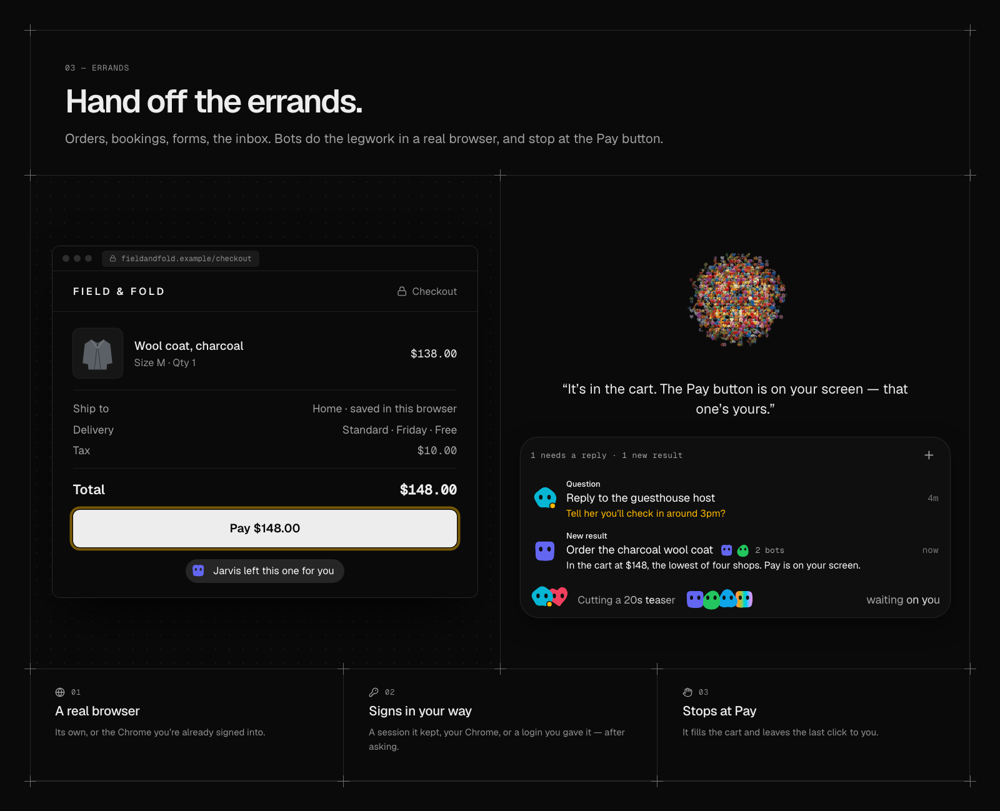
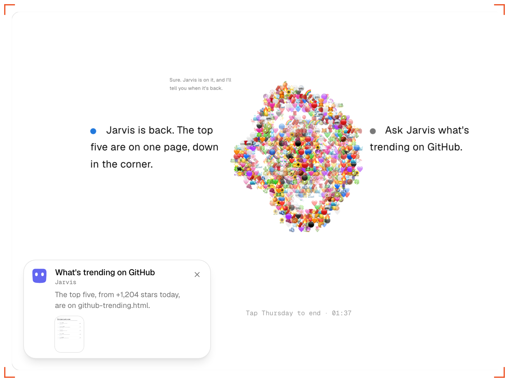
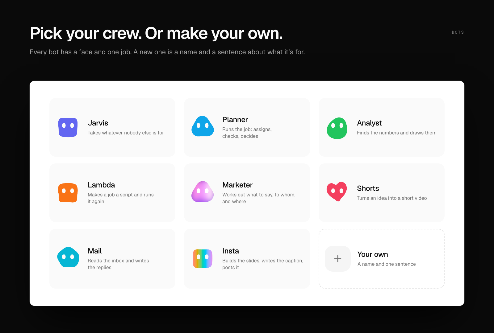
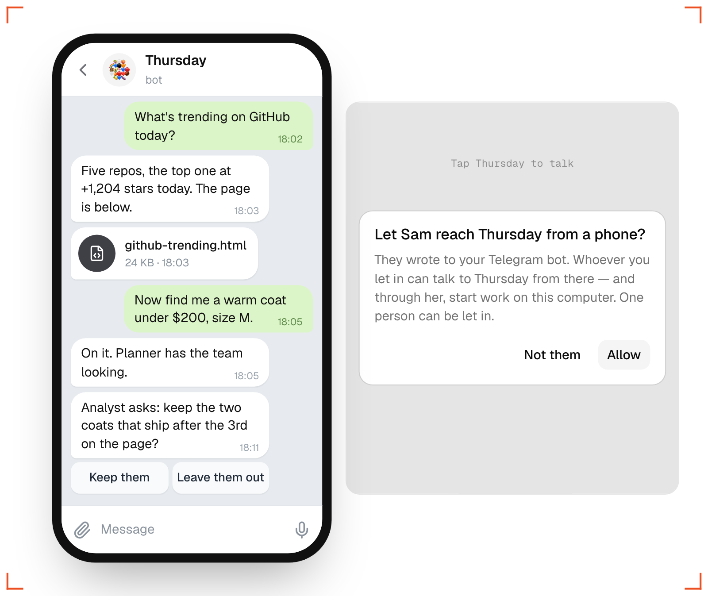

<div align="center">


### 다들 프라이데이를 원했다. 이건 서스데이다.

**GPT-Live 1로 말하는 오픈소스 음성 AI 비서. 내 컴퓨터에서 돌아가고, 뒤에는 AI 봇 팀이 있습니다.**<br>
전화하듯 말하면 됩니다. 오래 걸리는 일은 봇들이 진짜 브라우저와 셸로 처리하고, 그동안에도 통화는 이어집니다.

[](https://www.npmjs.com/package/thursday-agent)
[](https://github.com/cgoinglove/thursday/actions/workflows/ci.yml)
[](LICENSE)
[](https://nodejs.org)

[English](README.md) · [한국어](README.ko.md)



[▶ 1분 30초 데모 영상 보기 (소리 있음)](https://youtu.be/V7fBDY3cYRU)

</div>

## 빠른 시작

```bash
npx thursday-agent
```

Node.js 22.18 이상과 OpenAI API 키 하나면 됩니다. 첫 화면에 키를 넣고, 함께할 봇을 고른 뒤 **Thursday의 얼굴을 누르세요**. 가입도 `.env`도 없습니다. 한국어로 말하면 한국어로 답합니다. 음성은 그 키로 1분에 약 $0.05입니다.



## 이렇게 말해 보세요

- "20만 원 아래 코트 찾아서 한 페이지로 정리해 줘."
- "평일 아침 9시마다 메일 확인하고 답장 초안 써 놔."
- "동생 생일이 3월 3일인 거 기억해 줘."
- "아까 그 코트 어디까지 됐어?" 일이 아직 도는 중에 물어봐도 됩니다.

## 일하는 동안에도 말로

음성 모델이 직접 브라우저를 열면 1분쯤 말이 없어지고, 조용한 통화는 끊긴 통화나 다름없습니다. 그래서 Thursday는 통화를 둘로 나눕니다. GPT-Live 1이 대화를 붙들고, 몇 초 넘게 걸리는 일은 봇이 뒤에서 맡습니다. 말을 끊어도 되고, 딴 얘기를 해도 되고, 시킨 일이 어디까지 됐는지 물어봐도 됩니다.



## 한 문장이면 팀이 움직입니다

봇들은 일을 서로 나누고, 돌아온 결과를 확인하고, 내가 정해야 할 것만 나에게 묻습니다. 주고받은 말은 모두 남습니다. 스레드를 열면 누가 무엇을 했는지 보이고, 그 자리에서 끼어들 수도 있습니다.



## 심부름은 실제 브라우저로

주문, 예약, 신청서, 받은편지함. 봇은 자기 브라우저나 내가 이미 로그인한 Chrome을 씁니다. 로그인이 필요한 사이트면 봇이 창을 열어 주고 내가 직접 로그인하며, 앱은 그 로그인을 내가 허락한 봇에게만 빌려줍니다. 결제는 Pay 버튼 앞에서 멈추고 그 화면을 내 앞에 열어 둡니다.



## 남는 결과물

페이지, 차트, 영상, 슬라이드, 문서, 스크립트가 내 컴퓨터에 파일로 저장됩니다. 다 되면 화면 구석에 미리보기로 올라오고, "보여 줘" 하면 열립니다.



## 나만의 봇 팀

처음 실행할 때 기본 봇을 고르거나, 이름과 무엇을 하는 봇인지 한 문장으로 직접 만드세요. 봇마다 모델과 도구를 따로 줄 수 있습니다.



## 폰에서도

앱은 집 컴퓨터에서 돌고, 밖에서는 Telegram, Discord, Slack으로 말을 겁니다. 봇의 질문은 버튼으로 오고, Thursday가 말한 파일은 답과 함께 옵니다. 내 컴퓨터를 인터넷에 열지 않습니다.



## 그리고

- **전화를 끊어도 계속.** 작업은 내 컴퓨터에서 돌고, 끝나면 Thursday가 알려줍니다. 켜 두면 화면으로 먼저 전화를 걸어 옵니다.
- **말 대신 글로.** `/`를 누르고 쓰면 됩니다. 같은 기억, 같은 봇이고 마이크도 분당 요금도 없습니다.
- **루틴.** "평일 아침 9시마다 메일 확인해 줘." 봇과 할 일과 시간을 말로 정합니다.
- **읽을 수 있는 기억.** Thursday가 나에 대해 아는 건 평범한 노트입니다. 어느 줄이든 열고, 고치고, 지울 수 있습니다.
- **스킬과 MCP.** Agent Skills로 봇에게 새 방법을 가르치고, MCP 서버를 연결합니다.
- **모델은 자유롭게.** OpenAI, Anthropic, Google, xAI, Vercel AI Gateway, ChatGPT 로그인. 봇마다 다르게 고릅니다.
- **로컬 우선.** Thursday 계정도, 우리 서버도 없습니다. 앱과 데이터와 키가 모두 내 컴퓨터에 있습니다.

## 필요한 것

- Node.js 22.18+
- 음성용 OpenAI API 키
- macOS. Linux도 될 것이고, Windows는 아직 테스트하지 않았습니다.

<details>
<summary><b>비용이 드나요?</b></summary>

Thursday는 무료이고 MIT 라이선스입니다. 키는 직접 넣습니다. 음성은 통화가 열려 있는 동안 OpenAI 요금으로 1분에 약 $0.05이고, 말이 없는 시간도 포함됩니다([요금표](https://developers.openai.com/api/docs/pricing)). 20초 동안 아무 말이 없으면 통화는 알아서 끊깁니다. 봇은 각자 고른 제공자의 요금을 따릅니다.

</details>

<details>
<summary><b>내 데이터는 어디로 가나요?</b></summary>

통화에서 한 말과 봇이 다루는 내용은 내가 설정한 모델 제공자와 내가 연결한 서비스로 갑니다. "hey thursday" 호출어는 직접 켜기 전까지 꺼져 있습니다. 브라우저의 음성 인식을 쓰기 때문에, Chrome에서는 탭이 열려 있는 동안 마이크 소리가 Google로 갑니다. 얼굴을 누르거나 `alt+shift+T`를 쓰면 호출어 없이 통화가 시작됩니다. 앱은 `127.0.0.1`에서만 열리고, 통화와 기억과 파일은 `~/.thursday`에 있습니다(소스에서 실행하면 체크아웃 폴더).

</details>

<details>
<summary><b>봇이 내 컴퓨터를 써도 안전한가요?</b></summary>

봇은 실제 명령을 실행합니다. 강력한 로컬 도구로 다뤄주세요. 샌드박스가 아닙니다. 로그인 전에 묻고 결제 앞에서 멈추는 것은 모델이 따르는 지시이지 잠금장치가 아닙니다. 민감한 곳에 접근하게 하기 전에 [SECURITY.md](SECURITY.md)를 읽어주세요.

</details>

<details>
<summary><b>소스에서 실행</b></summary>

```bash
git clone https://github.com/cgoinglove/thursday.git
cd thursday
pnpm install
pnpm dev
```

pnpm 10+ 이 필요합니다.

</details>

<div align="center">

<br>

**[작동 방식](docs/how-it-works.md)** · [기여하기](CONTRIBUTING.md) · [보안](SECURITY.md) · [MIT](LICENSE)

치는 것보다 말하는 게 편하다면, [Thursday에 별을](https://github.com/cgoinglove/thursday) 눌러주세요. 돌려 보다 막힌 곳은 [이슈로 알려 주세요](https://github.com/cgoinglove/thursday/issues/new). 그 목록이 로드맵입니다.

</div>
