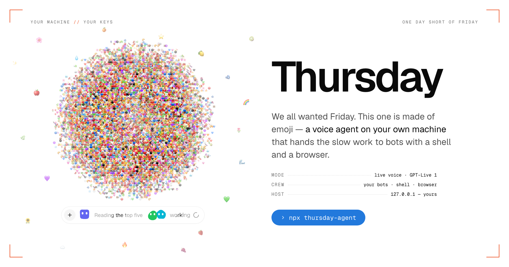
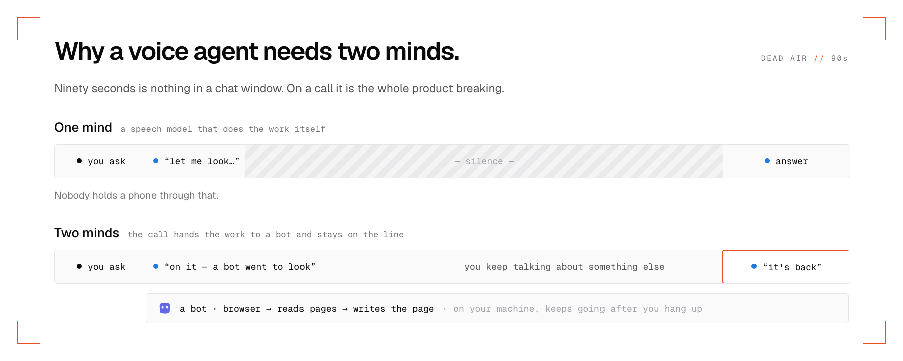
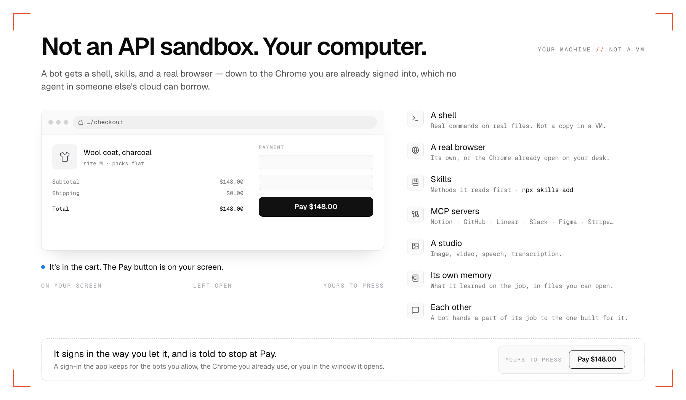
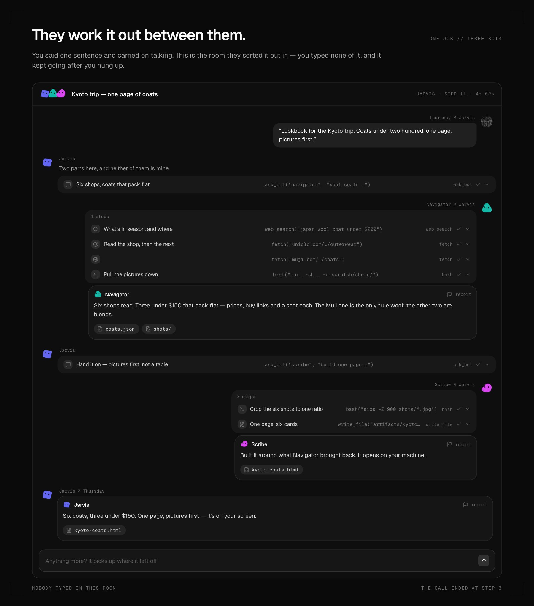
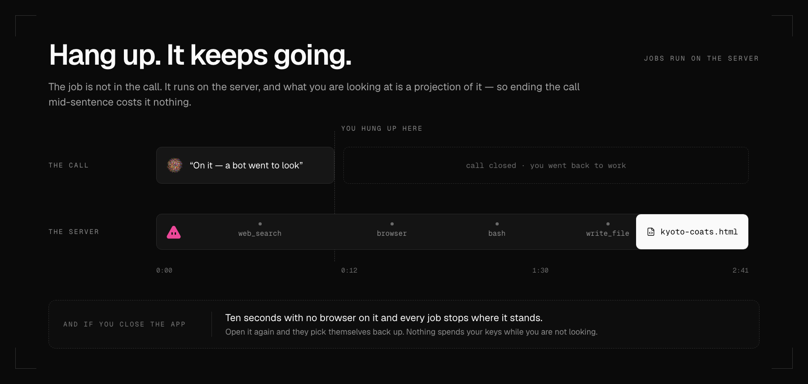

<div align="center">



### 다들 프라이데이를 원했다. 이건 서스데이다.

**내 컴퓨터에 사는 음성 에이전트.** 말하면, 일이 되고, 대화는 계속된다.

[](https://www.npmjs.com/package/thursday-agent)
[](https://github.com/cgoinglove/thursday/actions/workflows/ci.yml)
[](LICENSE)
[](https://github.com/cgoinglove/thursday/stargazers)

[English](README.md) · [한국어](README.ko.md)

</div>

!![video: 60초 데모, 1440×900, 라이트 테마, 브라우저 크롬 없이. 통화 하나를 처음부터 끝까지: "Hey Thursday" → "다음 주 교토 가는데 20만원 아래 코트 찾아서 한 페이지로 정리해줘" → "네, Navigator 가 보러 갔어요" → 다른 얘기를 계속하는 동안 통화 아래 작업 줄이 생기고 → 페이지가 저절로 열리고 → "돌아왔어요". "네, 보러 갔어요"부터 페이지가 열리기까지 12초를 GIF 로 잘라 바로 여기에 → `docs/images/demo.gif`; 전체는 YouTube 에 올려 그 아래 링크.]

```bash
npx thursday-agent
```

첫 화면에 API 키 하나. `.env` 도, 계정도, 클라우드도 없다. 설치는 이게 전부다.

<br>

## 이렇게 말해보세요

> **"다음 주 교토 가는데 20만원 아래 코트 찾아서 한 페이지로 정리해줘."**

*"네, Navigator 가 보러 갔어요"* 하고 **대화가 그대로 이어진다.** 그동안 봇이 진짜 브라우저로 쇼핑몰을 열고, 페이지를 읽고, 한 장으로 정리한다. 2분 뒤 화면에 저절로 열린다.

로딩 스피너를 본 적이 없다. 말을 멈춘 적도 없다.

<br>

## 말을 거는 하네스

**하네스**는 모델을 둘러싼 층이다. 모델이 무엇을 보고, 어떤 도구를 부를 수 있고, 명령이 어디서 돌고, 세션이 끝나도 무엇이 남는지를 정한다. Claude Code, [OpenClaw](https://github.com/openclaw/openclaw), [Hermes](https://github.com/NousResearch/hermes-agent) 가 하네스고, 올해 정말 좋아졌다.

**그리고 전부, 타이핑으로 부린다.**

음성을 생각 못 해서가 아니다. 음성이 하네스의 단 하나뿐인 일 — 긴 루프를 돈다 — 을 정면으로 깨기 때문이다. 브라우저를 여는 음성 모델은 90초를 조용히 있는다. 조용한 통화는 죽은 통화다. 아무도 수화기를 들고 그걸 견디지 않는다.



그래서 Thursday 는 **한 통화에 머리를 둘** 둔다. 실시간 음성 모델이 대화를 잡고, 한눈에 답할 수 있는 것만 만진다. 그보다 느린 건 전부 **봇** — 내 컴퓨터 전체를 가진 텍스트 모델 — 에게 가고, 뒤에서 돌다가 한 문장으로 돌아와 그녀가 소리 내어 말해준다.

대화가 끊기지 않는 이유는, 대화를 잡고 있는 쪽이 느린 일을 절대 안 하기 때문이다.

### 그리고 통화가 스킬을 읽는다

**스킬**은 `SKILL.md` 가 든 폴더다. 모델이 필요해졌을 때만 여는 내 지시서 한 장. Claude Code, Codex, OpenClaw 가 매 프롬프트에 싣지 않고도 집안 규칙을 익히는 방법이다.

스킬은 타이핑하는 에이전트를 위해 만들어졌다. 설정에서 켜면 **음성 모델이 말하다 말고 그걸 읽는다** — "늘 가던 데로 예약해줘"를 끝까지 설명하지 않아도 된다. 봇은 원래 항상 가지고 있다.

내가 찾은 한, 실시간 음성 모델이 이걸 하는 사례는 없다. 오히려 반대다 — 음성에 *대해* 쓰인 스킬들은 음성 앱을 만드는 코딩 에이전트에게 주는 지시서다. 아는 사례가 있으면 이슈를 열어달라. 이 문단은 그때 바뀐다.

<details>
<summary><b>LiveKit 이나 Realtime API 예제가 하는 것과 같은 거 아닌가?</b></summary>

머리를 둘로 나누는 것 자체는 새롭지 않다. OpenAI 가 직접 내놓은 [realtime-agents](https://github.com/openai/openai-realtime-agents) 가 "chat-supervisor" 패턴으로 보여주고, [LiveKit Agents](https://github.com/livekit/agents) 는 realtime 세션에 MCP 도구를 한 줄로 붙인다.

그것들은 프레임워크이고 데모다. 음성 에이전트를 만들 좋은 부품이다. 다만 supervisor 에게 건네주는 건 도구 목록이다.

Thursday 가 건네는 건 기계다 — 셸, 이미 로그인돼 있는 크롬, 스킬, 커넥터, 워크스페이스, 그리고 통화를 끊어도 계속 도는 일. 하네스가 먼저고, 음성은 그걸 부리는 방법이다. 차이는 그것뿐이고, 손이 많이 가는 쪽이 그 절반이다.

</details>

<br>

## 봇이 실제로 가진 것

API 샌드박스가 아니다. **내 컴퓨터다.**

- **셸** — 내 진짜 파일에 진짜 명령
- **진짜 브라우저** — 그리고 *이미 로그인돼 있는* 내 크롬에 그대로 붙는다. 내 메일, 내 계정, 이미 끝난 2FA. **클라우드 에이전트는 물리적으로 이걸 못 한다.**
- **스킬** — 브라우저, 이 Mac, 페이지 만들기. 나머지는 `npx skills add`
- **커넥터 46개** — Notion, GitHub, Linear, Slack, Figma, Stripe, Supabase… 각각 클릭 한 번
- **스튜디오** — 이미지, 영상, 음성, 받아쓰기
- **서로** — 봇이 자기 일의 한 조각을 그 일을 위해 존재하는 봇에게 넘긴다



로그인이 필요하면 내가 볼 수 있는 창에서 하고, 딱 한 곳에서 멈춘다 — **비밀번호.** 그 절반은 내 몫이다. 나머지는 끝까지 한다.

<br>

## 한 문장. 봇 셋. 내가 친 건 하나도 없다.



Jarvis 가 일을 받아 두 조각 다 자기 것이 아니라고 판단한다. Navigator 가 쇼핑몰 여섯 곳을 열어 읽는다. Scribe 가 그걸로 페이지를 짠다. 나에게는 한 문장으로, 소리로 온다 — 어떻게 됐는지 궁금하면 이 방을 열어 읽으면 된다.

<br>

## 끊어도 계속 돈다

작업은 통화 안에 있지 않다. 서버에서 돌고, 화면은 그걸 비춘 것뿐이다 — 그러니 말하다 말고 끊어도, 새 탭을 열어도, 10분 뒤에 돌아와도 된다. 뭐가 들어왔는지 말해준다. 허락하면 먼저 전화를 걸기도 한다.



대신 앱을 완전히 닫으면 정직한 쪽을 택한다. 브라우저가 10초 동안 붙어 있지 않으면 돌던 작업이 그 자리에 서고, 스레드는 그대로 남고, 내가 다시 이어주기를 기다린다. **안 보는 사이에 내 키를 태우지 않는다.**

<br>

## 나를 기억하고, 나는 그걸 읽을 수 있다

내 디스크의 평범한 노트. 한 줄에 사실 하나. 아무 에디터로나 열어보고, 지우고 싶으면 지운다.

그리고 통화가 끝날 때마다 텍스트 모델이 **실제로 오간 말을 다시 읽고** 노트와 맞춘다 — 말하는 도중에 적어둘 생각을 못 한 것까지 남게.

<br>

## 로컬 퍼스트, 여기선 구호가 아니다

| | |
|---|---|
| **내 브라우저** | 봇이 내 책상에 이미 열려 있는 크롬에 붙는다 — 내 세션, 내 로그인 |
| **내 컴퓨터** | 진짜 파일에 진짜 명령. 사본을 올린 VM 이 아니다 |
| **내 키** | 내 디스크의 SQLite. 봇이 도는 셸에서는 아예 지워진다 |
| **내 메모리** | 열고 고치고 지울 수 있는 평범한 텍스트 노트 |
| **계정 없음** | 가입할 게 없다. "서버"는 `127.0.0.1` 의 Node 프로세스다 |

**정직하게:** *지능*은 원격이다. 통화를 맡길 만한 로컬 실시간 음성 모델이 아직 없어서 음성은 OpenAI 나 xAI 로 간다. 나머지는 기계 밖으로 나가지 않는다. 로컬 음성 모델이 나오는 날, 준비돼 있는 앱은 이거다.

<br>

## 설치

```bash
npx thursday-agent
```

`localhost:3000` 에서 열린다. 이미 쓰는 게 있으면 다음 빈 포트로 뜬다. OpenAI 나 xAI 키 하나면 통화가 열린다 — 음성 키는 텍스트 키이기도 해서, 하나로 전부 돈다.

### 켜고 끄기

`n8n` 처럼, 실행한 터미널에서 돈다. 데몬도 없고 로그인 항목에 뭘 심지도 않는다.

| | |
|---|---|
| **끄기** | `Ctrl+C` |
| **다시 켜기** | 같은 `npx thursday-agent` |
| **터미널을 닫으면** | 같이 꺼진다. 뒤에 남는 게 없다 |
| **일하는 동안 띄워두려면** | 탭 하나를 내주거나 `npx thursday-agent &` |
| **다른 포트로** | `npx thursday-agent --port 4000` |
| **다른 경로에 저장** | `npx thursday-agent --home ~/work/thursday` |

**데이터는 그 전부보다 오래 산다.** 주고받은 말, 봇이 쓴 것, 키, 메모리가 전부 `~/.thursday` 에 있고 패키지 안에는 없다 — 그래서 다시 켜도, 컴퓨터를 껐다 켜도, 다음 버전으로 올려도 통화와 파일이 그대로다. 그 폴더를 지우는 게 삭제다.

```
~/.thursday
├── local.db          통화, 메모리, 봇, 작업, 키
└── .ai-workspace     봇이 쓴 것: 아티팩트, 스크래치, 스킬
```

첫 실행 때 봇이 쓸 브라우저(~280 MB)도 백그라운드에서 한 번 받는다. 그건 Playwright 자기 캐시에 들어간다 — macOS 는 `~/Library/Caches/ms-playwright`, Linux 는 `~/.cache/ms-playwright` — 그래서 이후 실행과 버전 업그레이드는 이 다운로드를 건너뛴다.

<details>
<summary><b>소스에서</b></summary>

```bash
git clone https://github.com/cgoinglove/thursday.git
cd thursday
pnpm install
pnpm dev
```

Node 22.18+, pnpm 10+. 첫 실행 때 봇이 쓸 브라우저(~280 MB)를 백그라운드에서 받는다.

</details>

<details>
<summary><b>어떤 모델을 쓸 수 있나</b></summary>

| | 제공자 |
|---|---|
| **음성** (통화) | OpenAI Realtime · xAI Grok Voice |
| **텍스트** (봇) | OpenAI · Anthropic · Google · xAI · Vercel AI Gateway — 실리는 모델 전부, 실시간 목록 |
| **스튜디오** | OpenAI · Google · xAI · Vercel AI Gateway |

봇마다 다른 모델로 돌릴 수 있다. 심부름꾼에겐 싼 걸, 계획하는 쪽엔 좋은 걸.

</details>

<details>
<summary><b>더 해볼 만한 열 마디</b></summary>

- "이번 주에 뭐 받았지?" — 명령 하나, 말하는 사이에 끝난다
- "언니 생일 3월 3일인 거 기억해." — 그 자리에서 저장된다
- "집주인한테서 온 메일 있어?" — 이미 로그인된 내 크롬에 붙는다
- "내 봇들이 쓸 구글 계정 하나 만들어줘." — 비밀번호에서 멈추고, 그다음 이어서 한다
- "오늘 정한 거 한 장으로 정리해줘." — 채팅 말풍선이 아니라 문서로 열린다
- "Crumb 이라는 빵집 로고 그려줘."
- "카드 명세서 훑어서 내고 있는 구독 전부 뽑아줘."
- "금요일 네 명 자리 예약해줘, 언니가 먹을 수 있는 데로."
- "이 페이지 지켜보다가 가격 떨어지면 알려줘."
- "웨딩 포즈 사진 서른 장 모아서 한 페이지로 만들어줘."

</details>

<br>

## 어디로 가나

**0.x** — 이 웹 앱. 하네스를 더: 더 나은 봇, 더 많은 스킬, 더 넓은 스튜디오, 그리고 실제로 그녀에게 말을 걸어본 첫 사람들이 요청하는 것들.

**1.0** — 데스크톱 앱. 같은 서버를 창 하나에, 마이크와 컴퓨터를 한 걸음 더 가까이.

뭐라고 말했고 어디서 멈췄는지 알려주면 된다. 그게 로드맵이다.

<br>

## 솔직하게 말하는 부분

이건 셸과 브라우저와 내 API 키를 가진 언어 모델이다. **사고가 아니라 그게 제품이다.** 키는 셸에 닿지 않는다. 쓰기는 워크스페이스 안으로 제한된다. 서버는 localhost 전용이다. 비밀번호, 일회용 코드, 패스키는 내가 친다.

샌드박스가 아니고, 아닌 척하지도 않는다. → [SECURITY.md](SECURITY.md)

macOS 에서 만들었다. Linux 는 될 것이고, Windows 는 확인하지 않았다.

<br>

---

<div align="center">

**컴퓨터가 일하는 동안 그냥 말을 걸고 싶었던 적이 있다면 — 별을 눌러주세요.**<br>
그게 계속할 이유가 됩니다.

[](https://star-history.com/#cgoinglove/thursday&Date)

[어떻게 돌아가나](docs/how-it-works.md) · [기여](CONTRIBUTING.md) · [아키텍처](CLAUDE.md) · [MIT](LICENSE)

</div>
