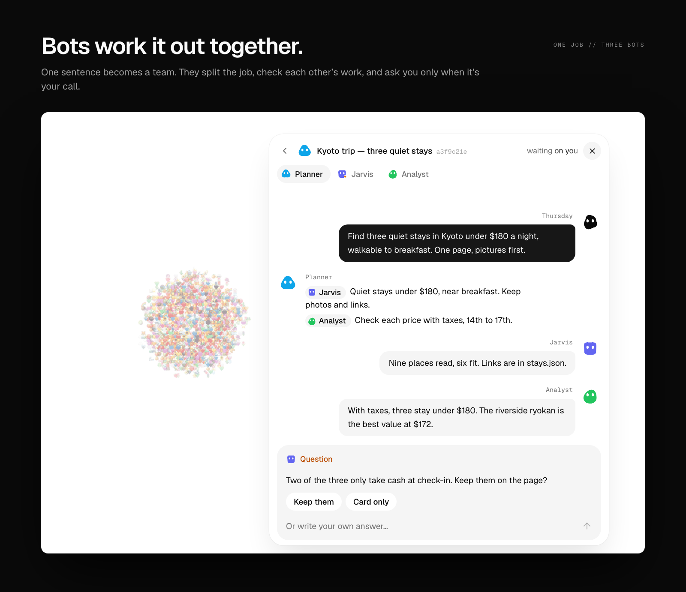
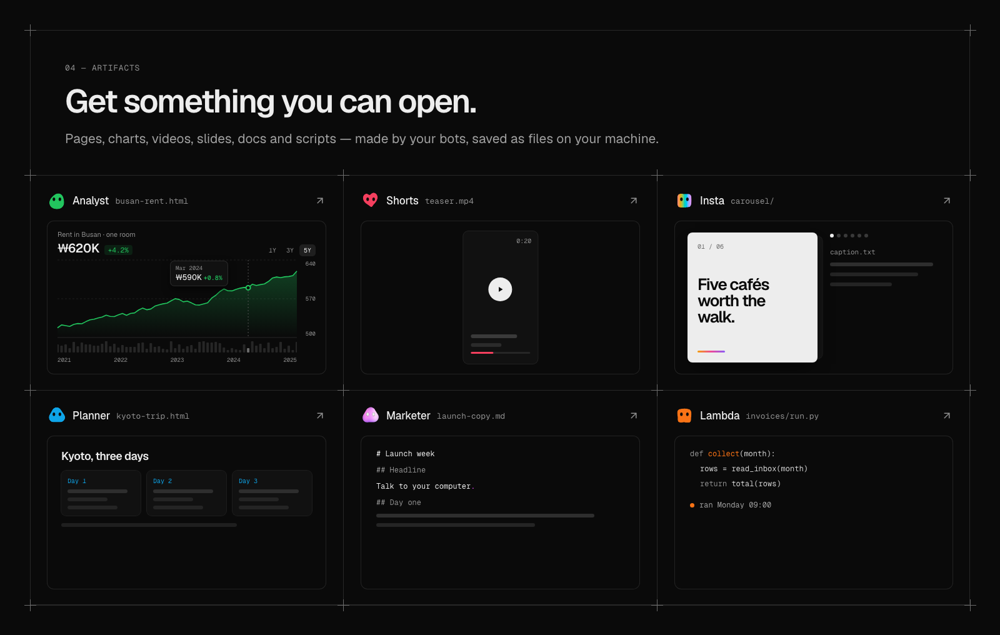

<div align="center">


### 다들 프라이데이를 원했다. 이건 서스데이다.

**내 컴퓨터에서 돌아가는 오픈소스 음성 AI 비서. 뒤에는 AI 봇 팀이 있습니다.**<br>
나는 말하고, 느린 일은 봇들이 실제 브라우저와 셸과 내 파일로 처리합니다. 대화는 끊기지 않습니다.

[](https://www.npmjs.com/package/thursday-agent)
[](https://github.com/cgoinglove/thursday/actions/workflows/ci.yml)
[](LICENSE)
[](https://github.com/cgoinglove/thursday/stargazers)

[English](README.md) · [한국어](README.ko.md)

</div>

## 빠른 시작

```bash
npx thursday-agent
```

OpenAI API 키를 넣고, 처음 쓸 봇을 고르고, **“hey thursday”**라고 말하세요. 계정도 `.env`도 필요 없습니다.

## 일하는 동안에도 말로

대부분의 에이전트는 입력하고 기다려야 합니다. Thursday는 중간에 끼어들 수 있는 실시간 음성 통화입니다. 몇 초 넘게 걸리는 일은 봇이 백그라운드에서 맡으니 통화가 조용해지지 않고, 끝나면 Thursday가 알려줍니다.


## 한 문장이면 팀이 움직입니다

봇들은 일을 서로 나누고, 돌아온 결과를 확인하고, 내가 정해야 할 것만 나에게 묻습니다. 주고받은 말은 모두 남습니다. 스레드를 열면 누가 무엇을 했는지 보이고, 그 자리에서 끼어들 수도 있습니다.



## 심부름은 실제 브라우저로

주문, 예약, 신청서, 받은편지함. 봇은 자기 브라우저나 내가 이미 로그인한 Chrome을 쓰고, 내가 준 로그인 정보는 먼저 물어본 뒤에만 씁니다. 결제는 Pay 버튼 앞에서 멈추고 그 화면을 내 앞에 열어 둡니다.


## 남는 결과물

페이지, 차트, 영상, 슬라이드, 문서, 스크립트가 내 컴퓨터에 파일로 저장되고, 준비되면 화면에 열립니다.



## 나만의 봇 팀

처음 실행할 때 기본 봇을 고르거나, 이름과 무엇을 하는 봇인지 한 문장으로 직접 만드세요. 봇마다 모델과 도구를 따로 줄 수 있습니다.


## 그리고

- **전화를 끊어도 계속.** 작업은 내 컴퓨터에서 돌고, 끝나면 Thursday가 알려줍니다. 원하면 먼저 전화를 걸어 오게 할 수도 있습니다.
- **읽을 수 있는 기억.** Thursday가 나에 대해 아는 건 평범한 노트입니다. 어느 줄이든 열고, 고치고, 지울 수 있습니다.
- **스킬과 MCP.** Agent Skills로 봇에게 새 방법을 가르치고, MCP 서버를 연결합니다.
- **모델은 자유롭게.** OpenAI, Anthropic, Google, xAI, Vercel AI Gateway, ChatGPT 로그인. 봇마다 다르게 고릅니다.
- **로컬 우선.** Thursday 계정도, 우리 서버도 없습니다. 앱과 데이터와 키가 모두 내 컴퓨터에 있습니다.

## 필요한 것

- Node.js 22.18+
- 음성용 OpenAI API 키
- macOS. Linux도 될 것이고, Windows는 아직 테스트하지 않았습니다.

<details>
<summary><b>비용이 드나요?</b></summary>

Thursday는 무료이고 MIT 라이선스입니다. 키는 직접 넣습니다. 음성은 OpenAI가 통화 중 사용한 분 단위로 과금하고, 봇은 각자 고른 제공자의 요금을 따릅니다.

</details>

<details>
<summary><b>내 데이터는 어디로 가나요?</b></summary>

내가 한 말과 봇이 다루는 내용은 내가 설정한 모델 제공자와 내가 연결한 서비스에만 갑니다. 앱은 `127.0.0.1`에서만 열리고, 통화와 기억과 파일은 `~/.thursday`에 있습니다(소스에서 실행하면 체크아웃 폴더).

</details>

<details>
<summary><b>봇이 내 컴퓨터를 써도 안전한가요?</b></summary>

봇은 실제 명령을 실행합니다. 강력한 로컬 도구로 다뤄주세요. 샌드박스가 아닙니다. 민감한 곳에 접근하게 하기 전에 [SECURITY.md](SECURITY.md)를 읽어주세요.

</details>

<details>
<summary><b>소스에서 실행</b></summary>

```bash
git clone https://github.com/cgoinglove/thursday.git
cd thursday
pnpm install
pnpm dev
```

pnpm 10+ 이 필요합니다.

</details>

<div align="center">

<br>

**[작동 방식](docs/how-it-works.md)** · [기여하기](CONTRIBUTING.md) · [보안](SECURITY.md) · [MIT](LICENSE)

치는 것보다 말하는 게 편하다면, [Thursday에 별을](https://github.com/cgoinglove/thursday) 눌러주세요.

</div>
